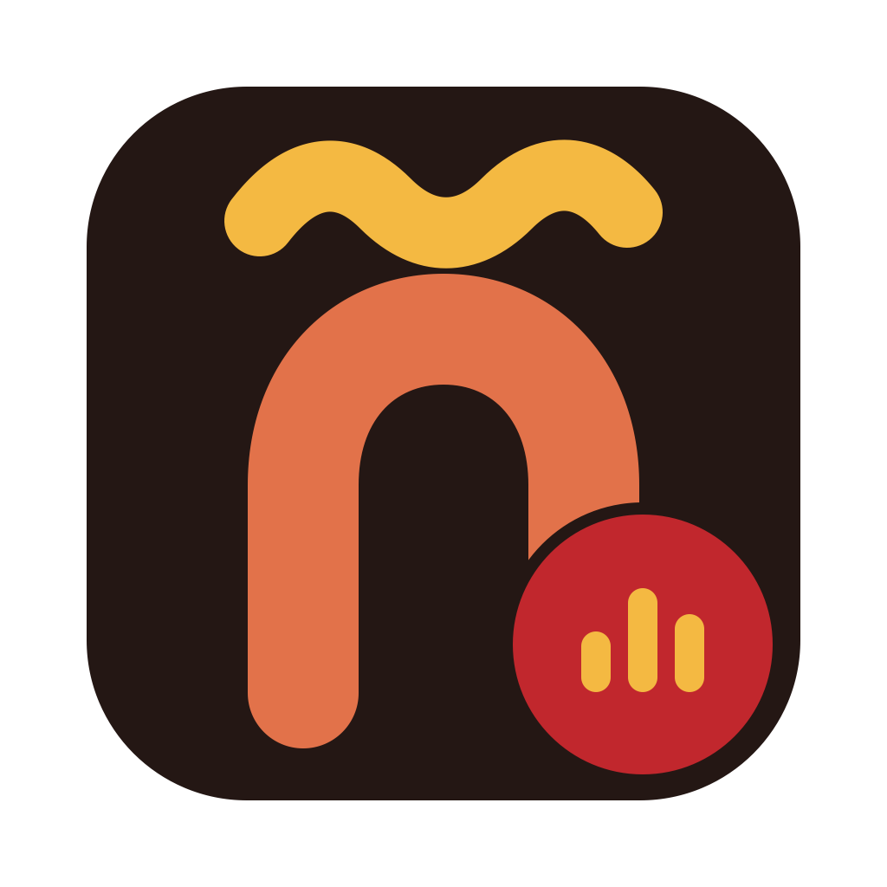
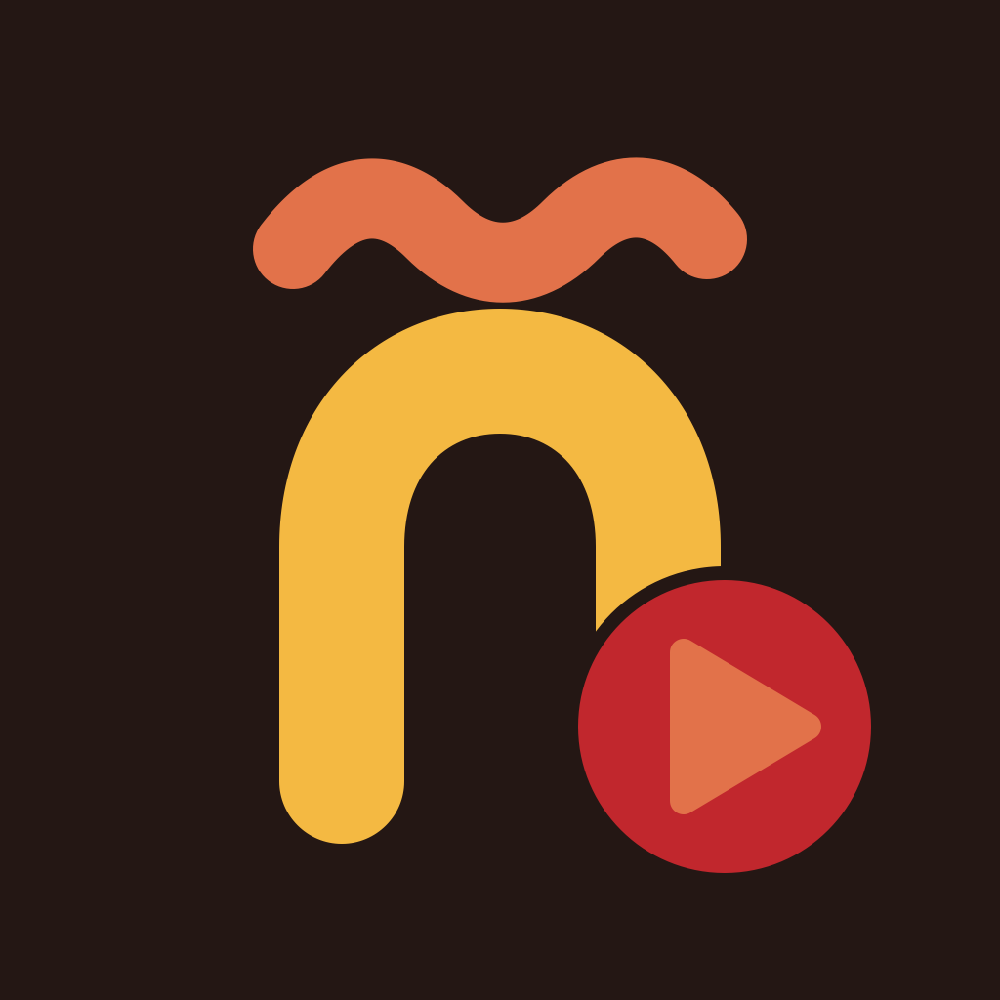

# Брендинг: Combine + Audio Learner

Единый визуальный стиль для пары приложений системы изучения испанского.

## Концепция

Мотив: буква **«ñ»**, собранная из звуковой волны — испанский язык + аудио в одном
знаке. Плоский стиль, 3 цвета на тёмном фоне, крупные формы без мелких деталей —
читается уже при 16 px.

- **Дуга «n»** — толстая скруглённая арка (единая линия-обводка с круглыми
  концами), формирующая тело буквы.
- **Волнистая тильда** над дугой — одновременно диакритический знак «ñ» и
  стилизованная аудио-волна (два плавных горба вместо прямой типографской
  тильды).
- **Бейдж в правом нижнем углу** — различает приложения по функции:
  - **Combine** (генератор) — три полоски эквалайзера.
  - **Audio Learner** (плеер) — треугольник play.

Оба приложения используют один и тот же силуэт и тёмный фон (родственный
вид), но меняют местами основной/акцентный цвет и бейдж (различимы с одного
взгляда в Dock/на домашнем экране).

## Палитра

| Роль | Цвет | HEX |
|---|---|---|
| Фон | тёмный тёплый (почти чёрный с коричневым подтоном) | `#241714` |
| Терракота | тёплый оранжевый | `#E2724A` |
| Жёлтый / золото | тёплый жёлтый | `#F4B942` |
| Глубокий красный | фламенко-красный, только бейдж | `#C1272D` |

**Combine**: дуга — терракота `#E2724A`, тильда — золото `#F4B942`, бейдж —
красный кружок `#C1272D` с золотыми полосками эквалайзера.

**Audio Learner**: дуга — золото `#F4B942`, тильда — терракота `#E2724A`
(основной/акцентный цвет зеркально меняются местами относительно Combine),
бейдж — тот же красный кружок `#C1272D` с терракотовым треугольником play.

## Превью

| Combine | Audio Learner |
|---|---|
|  |  |

## Файлы

```
shared/branding/
├── combine-icon.svg              — мастер-SVG Combine, 1024×1024, viewBox "0 0 1024 1024"
├── audiolearner-icon.svg         — мастер-SVG Audio Learner, 1024×1024
├── combine-icon-1024.png         — растровый рендер Combine (RGBA, скруглённые
│                                    прозрачные углы — macOS Big Sur+ "squircle")
├── audiolearner-appicon-1024.png — App Store иконка iOS: 1024×1024, БЕЗ альфа-канала
│                                    (полностью непрозрачный квадрат)
├── combine.iconset/              — 10 PNG (16…1024, включая @2x) для iconutil
├── combine-icon.icns             — готовая .icns для electron-builder
├── tools/
│   ├── build-icons.sh            — пересобирает все файлы выше из двух SVG
│   ├── strip-alpha.mjs           — убирает альфа-канал из PNG (без npm-зависимостей)
│   └── .gitignore                — node_modules/ (на случай будущих зависимостей)
└── README.md                     — этот файл
```

Обе SVG самодостаточны: без внешних шрифтов, без `<text>` — весь мотив (включая
тильду) собран вручную из простых `<path>`/`<rect>`/`<circle>`.

## Как подключить

### Combine (macOS, electron-builder)

Реальный `combine/electron-builder.yml` (не `docs/DEPLOYMENT.md` — тот черновой ТЗ с фактическими
неточностями, см. предупреждение в его шапке) ждёт иконку в `combine/build/icon.icns`
(`buildResources: build` + `mac.icon: build/icon.icns`). Она уже лежит там и совпадает
байт-в-байт (SHA-256) с `combine-icon.icns` из этой папки — обновлять при мёрже нужно, только
если мастер-SVG изменился:

```bash
cp shared/branding/combine-icon.icns combine/build/icon.icns
```

`electron-builder.yml` уже указывает `icon: build/icon.icns` — менять не нужно. **Не кладите
иконку в `combine/assets/`** — такой папки electron-builder не читает вообще, файл там будет
просто мёртвым грузом.

Для иконки окна в dev-режиме (BrowserWindow до упаковки) можно передать PNG
напрямую:

```ts
new BrowserWindow({
  // ...
  icon: path.join(__dirname, '../../shared/branding/combine-icon-1024.png'),
})
```

*(Windows-иконка `.ico` для `win.icon` в `DEPLOYMENT.md` в эту задачу не входила
— при необходимости её можно сгенерировать из того же `combine-icon.svg` тем
же пайплайном, добавив шаг `sips`→`.ico`-конвертер или `png2icns`-аналог.)*

### Audio Learner (iOS, Assets.xcassets)

1. В Xcode открыть `ios/AudioLearner/Assets.xcassets` → `AppIcon`.
2. Использовать режим **Single Size** (iOS 17+ достаточно одного изображения
   1024×1024, systema сама генерирует остальные размеры).
3. Перетащить `audiolearner-appicon-1024.png` в слот 1024×1024.
4. Проверить, что Xcode не ругается на альфа-канал (файл уже без прозрачности —
   `sips -g hasAlpha` возвращает `no`).

Если проект генерируется через XcodeGen (`ios/project.yml`), путь к иконке
описывается в `Assets.xcassets/AppIcon.appiconset/Contents.json`
(создаётся/обновляется через Xcode UI после шага 1–3, коммитится вместе с
проектом).

## Пайплайн рендера

Прямого CLI-растеризатора SVG в macOS нет. Рабочий пайплайн (проверен, доведён
до конца):

1. **SVG → PNG 1024**: `qlmanage -t -s 1024 -o . file.svg` — QuickLook рендерит
   SVG в PNG честно (обводки, скругления, кривые — без искажений). Результат
   всегда `RGBA`, даже если во SVG нет прозрачности.
2. **Комплект для .icns**: `sips -z <N> <N> combine-icon-1024.png` для 7
   размеров (16/32/64/128/256/512/1024), разложенных по 10 именам файлов
   `iconutil` (некоторые пиксельные размеры используются дважды — напр. 512 px
   это и `icon_256x256@2x.png`, и `icon_512x512.png`). Затем
   `iconutil -c icns combine.iconset -o combine-icon.icns`.
3. **PNG для App Store без альфы**: `sips` не умеет убирать альфа-канал напрямую
   (нет такого флага), а конвертация через JPEG внесла бы потери сжатия.
   Вместо этого — `tools/strip-alpha.mjs`: маленький Node-скрипт без
   npm-зависимостей (только встроенный `zlib`), который разбирает PNG-чанки,
   разворачивает scanline-фильтры, отбрасывает альфа-байт на пиксель и
   запаковывает обратно уже как `color type 2` (RGB). Без потерь, без
   сторонних библиотек.

Полная пересборка (из корня `shared/branding/`):

```bash
bash tools/build-icons.sh
```

Скрипт идемпотентен: рендерит SVG → 1024 PNG, чистит альфу для iOS-иконки,
собирает `.iconset` и пакует `.icns`.

## Проверка

Выполнено перед коммитом:

- [x] `combine-icon.icns` существует, не пустой (177 КБ), `file` подтверждает
      `Mac OS X icon ... "ic12" type`; round-trip `iconutil -c iconset` вернул
      все 10 ожидаемых файлов правильных размеров.
- [x] `audiolearner-appicon-1024.png`: 1024×1024, `sips -g hasAlpha` → `no`.
- [x] Оба мастер-SVG повторно открыты через `qlmanage -t` без ошибок.
- [x] Ни один файл в коммите не превышает 2 МБ (самый крупный — `combine-icon.icns`,
      177 КБ; вся папка `shared/branding/` — около 470 КБ).
- [x] `tools/node_modules` не создавался (скрипт без зависимостей), но
      `.gitignore` на всякий случай добавлен.
